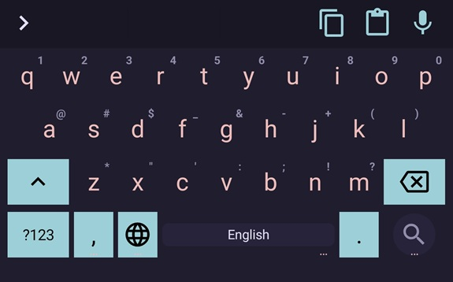
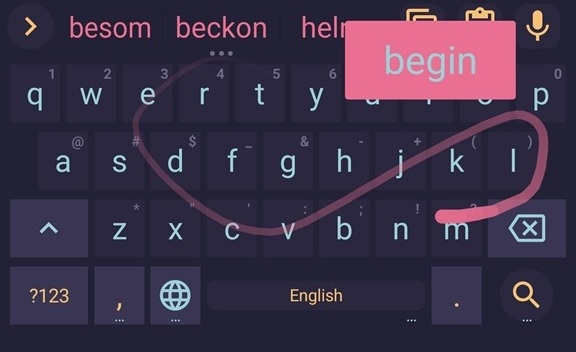
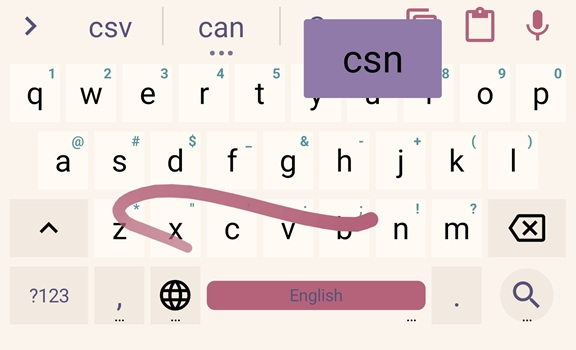

    
    <h2 align="center">Rosé Pine for HeliBoard</h2>

All natural pine, faux fur and a bit of soho vibes for the classy minimalist

## Usage

1. Download the `.json` file for the theme you want from the `themes/` folder
   - For example, `RosePine.json`
2. Open **LeanType** keyboard or **HeliBoard** keyboard on your Android device
3. Go to **Settings → Appearance → Themes**
4. Tap the **import/load** button and select the downloaded `.json` file
5. Apply the theme

**Note:** All themes have gesture trail customization, irrelevant of whether the screenshot illustrates it.

## Gallery

### Rosé Pine

### Rosé Pine Moon

### Rosé Pine Dawn

## Thanks to

- [Star-Trowa](https://github.com/Star-Trowa)
